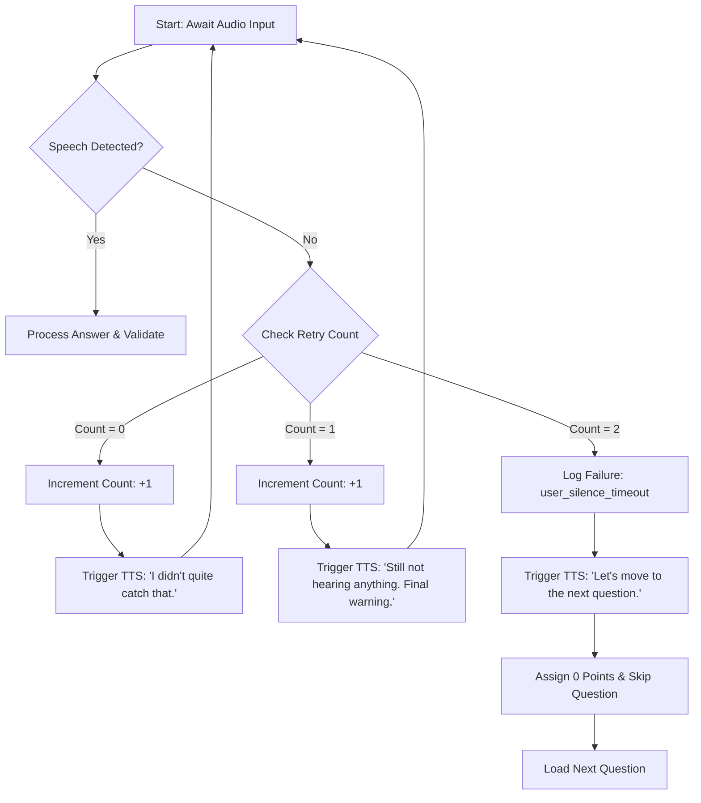
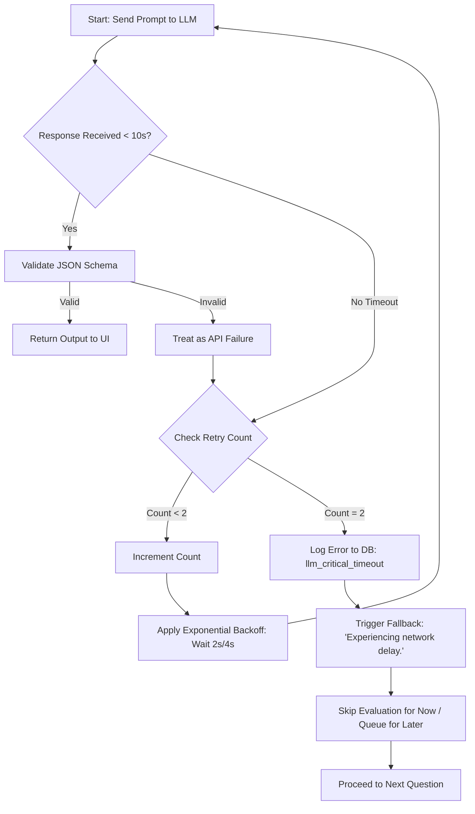

<div align="center">

# 🛡️ AI Interview & Assessment Monitoring System
### Phase 1 — Reliability Layer: Failure Handling & Recovery Engine


> **Middleware that intercepts failures, retries intelligently, and never lets a crash reach the candidate.**

</div>

---

## 📌 Problem Statement

In live assessment environments, things go wrong:

- 🌐 External LLM APIs time out under load
- 📡 Networks disconnect mid-session
- 🤐 Candidates stay silent or submit invalid answers

Without a dedicated reliability layer, these edge cases cause **system crashes** and **broken candidate experiences**. This module solves that.

---

## 🧩 Architecture Overview

```
Incoming Request
      │
      ▼
┌─────────────────────────────┐
│     FastAPI  (main.py)      │  ← Exposes /api/evaluate_answer
└────────────┬────────────────┘
             │
             ▼
┌─────────────────────────────┐
│  FailureHandler Middleware  │  ← error_handler.py
│                             │
│  • handle_user_silence()    │  → Prompt → Retry → Skip (0 pts)
│  • handle_llm_timeout()     │  → Backoff → Retry → Graceful abort
└────────────┬────────────────┘
             │
      ┌──────┴──────┐
      ▼             ▼
ErrorLogSchema  UIResponseSchema
(DB Logging)    (Frontend Response)
```

---

## 🗂️ Core Modules

### `error_handler.py` — The Reliability Middleware

The heart of this system. Completely decoupled from the main assessment engine, built API-first with strict Pydantic validation.

| Component | Type | Responsibility |
|---|---|---|
| `ErrorLogSchema` | Pydantic Model | Standardizes error logs — timestamps, incident IDs, severity levels — for DB insertion |
| `UIResponseSchema` | Pydantic Model | Formats fallback text and action commands returned to the frontend |
| `FailureHandler` | Class | Tracks per-session retry state and executes the correct recovery strategy |

---

### `main.py` — FastAPI Integration Layer

A lightweight server that demonstrates the middleware in action. Exposes a single testing endpoint to simulate both failure modes.

```
POST /api/evaluate_answer
```

| Parameter | Type | Description |
|---|---|---|
| `session_id` | `string` | Candidate session identifier |
| `answer_text` | `string` | The candidate's submitted answer |
| `simulate_timeout` | `boolean` | Forces LLM timeout simulation when `true` |

---

## 🔄 Failure Flow Diagrams

### 1. User-Side Failure — Candidate Silence 🤐

Triggered when the microphone is active but no speech is detected. The system re-prompts the candidate up to twice before gracefully skipping the question.



---

### 2. System-Side Failure — LLM Timeout & API Error ⏱️

Triggered when the Generative AI engine fails to respond within the threshold. Applies exponential backoff before gracefully aborting and queuing the evaluation.



---

## ⚙️ Getting Started

### Prerequisites

- Python **3.8+**

### Installation

```bash
# Clone the repository
git clone https://github.com/your-username/your-repo-name.git
cd your-repo-name

# Install dependencies
pip install fastapi uvicorn pydantic
```

### Start the Server

```bash
uvicorn main:app --reload
```

The server will be live at `http://127.0.0.1:8000`

---

## 🧪 Testing

FastAPI provides a built-in interactive UI — no frontend or Postman required.

**Open:** [`http://127.0.0.1:8000/docs`](http://127.0.0.1:8000/docs)

---

### Test Case 1 — User Silence 🤐

| Field | Value |
|---|---|
| `session_id` | `cand_123` |
| `answer_text` | ` ` *(single space)* |
| `simulate_timeout` | `false` |

**Expected behavior:**
- **Click 1:** System prompts the candidate to speak
- **Click 2:** System re-prompts with a final warning
- **Click 3:** Retry limit hit → question skipped with **0 points**

---

### Test Case 2 — LLM Timeout & Exponential Backoff ⏱️

| Field | Value |
|---|---|
| `session_id` | `cand_123` |
| `answer_text` | `Python is a high-level programming language` |
| `simulate_timeout` | `true` |

**Expected behavior:**
- **Click 1:** Terminal shows a **2s delay** → returns `retrying` status
- **Click 2:** Terminal shows a **4s delay** → returns `retrying` status
- **Click 3:** Max retries exhausted → LLM call aborted, question skipped gracefully

---

## 🔑 Design Principles

- **Decoupled middleware** — zero tight coupling with the core assessment engine
- **Strict schema validation** — all inputs and outputs typed via Pydantic
- **Stateful per session** — retry counters are tracked per `session_id`, not globally
- **Graceful degradation** — every failure path ends in a clean UX state, never a crash

---

## 📁 Project Structure

```
├── error_handler.py    # Core reliability middleware (FailureHandler + schemas)
├── main.py             # FastAPI server and route definitions
└── README.md
```

---

<div align="center">

**Part of the AI Interview & Assessment Monitoring System — Phase 1**

</div>
